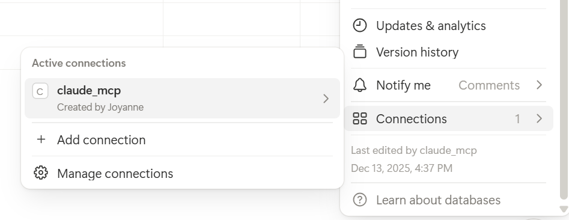

# Canvas MCP Server

A Model Context Protocol (MCP) server that interfaces with the Canvas Learning Management System (LMS). This server allows AI models to interact with Canvas to retrieve course data, assignments, announcements and group project details.

## Prerequisites

- Python 3.10 or higher
- A Canvas API Key

## Installation

1. Clone the repository:

   ```bash
   git clone <repository-url>
   cd canvas-mcp-server
   ```

2. Create and activate a virtual environment (optional but recommended):

   ```bash
   python -m venv .venv
   # Windows
   .venv\Scripts\activate
   # macOS/Linux
   source .venv/bin/activate
   ```

3. Install the dependencies:
   ```bash
   pip install mcp httpx python-dotenv canvasapi
   ```

## Configuration

1. Create a `.env` file in the root directory of the project.
2. Add your Canvas API key to the `.env` file:

   ```env
   CANVAS_API_KEY=your_canvas_api_key_here
   ```

> **Note**: The Canvas API URL is currently hardcoded to `https://canvas.qut.edu.au/` in `src/server.py`. If you are using a different Canvas instance, you will need to modify the `API_URL` variable in that file.

## Connect to Claude Desktop

Make sure you have Claude Desktop installed.
Find the Claude config file:

- Mac: `~/Library/Application Support/Claude/claude_desktop_config.json`

- Windows: `%APPDATA%\Claude\claude_desktop_config.json`

Add this and replace with your own file path:
```bash
   {
      "mcpServers": {
         "canvas-mcp": {
            "command": "uv",
            "args": [
            "run",
            "--with",
            "mcp",
            "--with",
            "canvasapi",
            "python",
            "YOUR_FILE_PATH\\src\\server.py"
            ]
         }
      }
   }
```
> **Note:** Always quit Claude after you make changes to the config file. 
>- Windows: Click on the up arrow on the right side of your taskbar and right-click on the Claude icon to "Quit" 
>- Mac: ⌘Q 

## Connect to Notion

You can get your API key by creating a new integration [here](https://www.notion.so/profile/integrations).
1. Give your API key a name (```claude_mcp```)
2. Choose your Notion workspace
3. Copy your integration key and replace it in your Claude config file

```bash
   {
      "mcpServers": {
         "notionApi": {
            "command": "npx",
            "args": ["-y", "@notionhq/notion-mcp-server"],
            "env": {
            "OPENAPI_MCP_HEADERS": "{\"Authorization\": \"Bearer YOUR_NOTION_API_KEY\", \"Notion-Version\": \"2022-06-28\" }"
            }
         }

      }
   }
```

4. In Notion, click the ```...``` (three dots) on the right top corner and search for your new integration ```claude_mcp```


